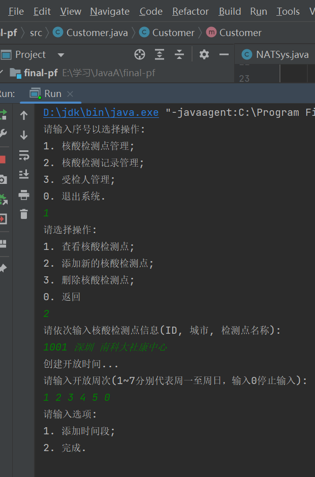
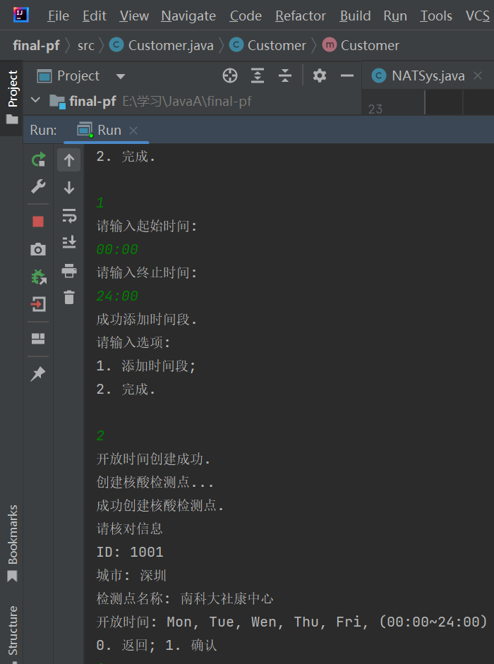
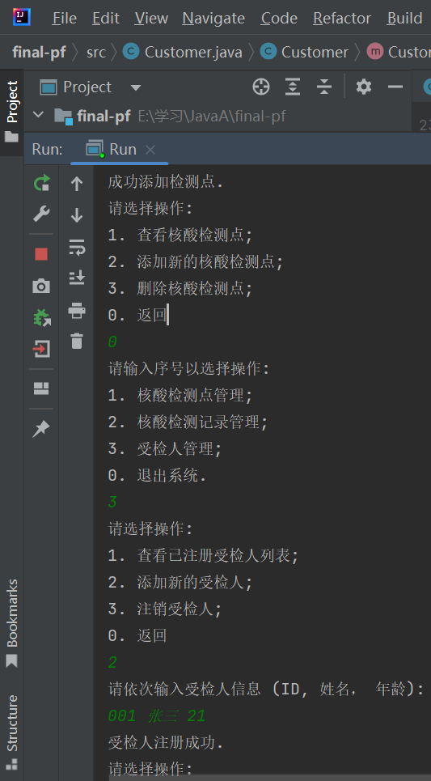
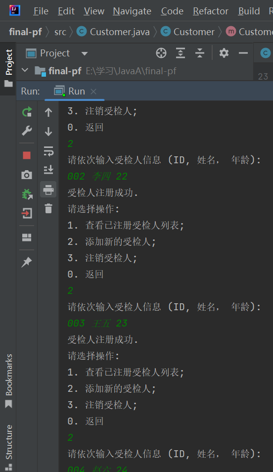
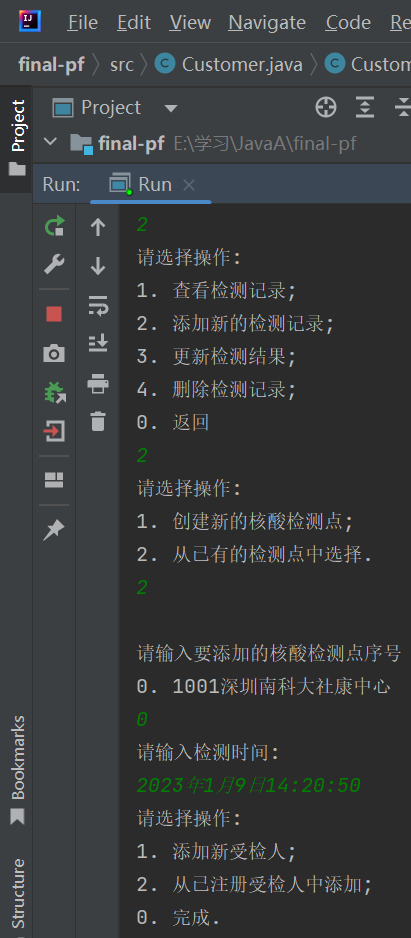
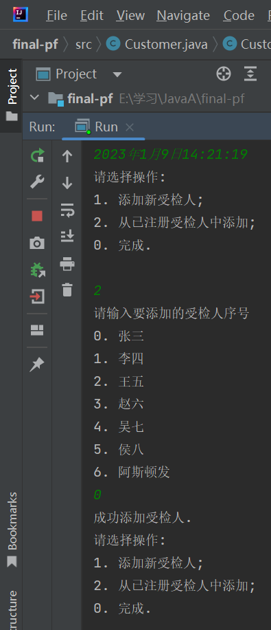
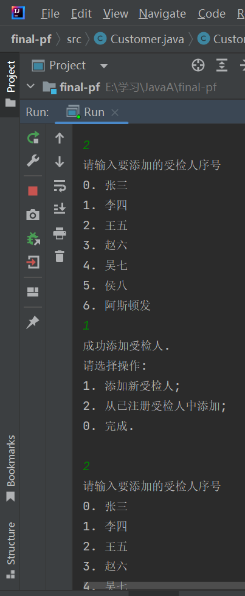
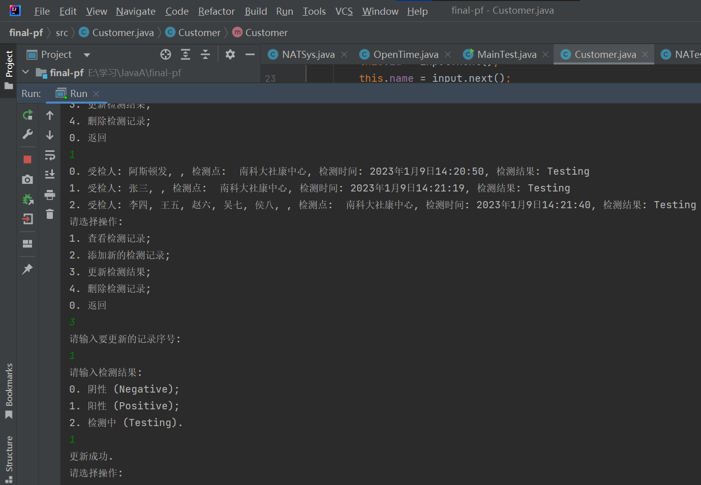
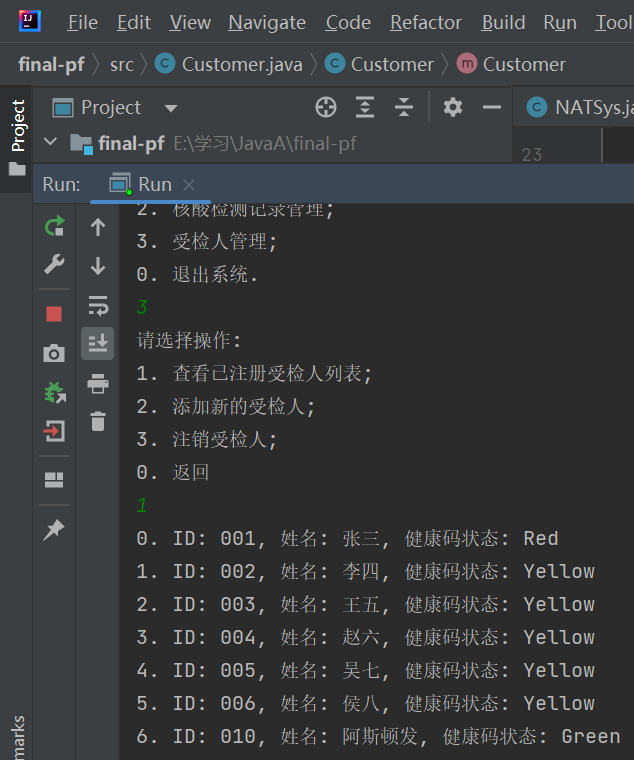

# CS109期末P/F项目

## 1. 基本思路

### 1.1 创建类

**核酸检测点**

- TestSite
  - 类属性
    - siteID - 站点ID (int)
    - city - 城市 (String)
    - name - 名称 (String)
    - openTime - 开放时间 (OpenTime的实例化)
  - 主要方法
    - toString
    - 两个构造方法 (1) 含 Args 的 TestSite(...); (2) 不含 Args 依靠 Scanner 读取用户输入的 TestSite().

**开放时间**

- OpenTime
  - 类属性
    - weekday - 开放的星期列表 (String[]) e.g. Monday, Tuesday, Wednesday, etc.
    - timePeriods - 开放的时间列表 (ArrayList) (TimePeriod构成的ArrayList)
  - 主要方法
    - @Override toString()
    - 两个构造方法 (1) 含 Args 的 OpenTime(...); (2) 不含 Args 依靠 Scanner 读取用户输入的 OpenTime().

**时间**

- TimePeriod
  - 类属性
    - startTime
    - endTime
  - 主要方法
    - toString

**受检人**

- Customer
  - 属性
    - id
    - name
    - age
    - healthCode - Green, Yellow, and Red;
  - 主要方法
    - toString
    - 两个构造方法 (1) 含 Args 的 Customer(...); (2) 不含 Args 依靠 Scanner 读取用户输入的 Customer().

**核酸检测**

- NATest
  - 属性
    - TestSite
    - Customer - 如果是混检则为10人构成的Array;
    - testTime - 采样日期+时间 e.g. 2023年1月8日20:05:12;
    - testResult - 检测结果：Positive, Negative, Testing (检测中);
  - 主要方法
  - toString
  - 两个构造方法 (1) 含 Args 的 NATest(...); (2) 不含 Args 依靠 Scanner 读取用户输入的 NATest().

**核酸检测系统**

- NATSys
  - 属性
    - testSiteList - 核酸检测站点列表;
    - customerList - 已注册受检人列表;
    - testRecord - 一个NATest构成的ArrayList;

### 1.2 特殊类

**枚举类**

- WeekDay

```java
enum WeekDay{Mon, Tue, Wen, Thu, Fri, Sat, Sun;}
```

- TestResult

```java
enum TestResult{Positive, Negative, Testing}
```

**执行类**

- Run
  - 主要方法
    - Run() - 运行核酸检测系统;
    - 主方法 main，执行 Run().

## 2. 运行演示

### 2.1 初始界面

```java
请输入序号以选择操作:
1. 核酸检测点管理;
2. 核酸检测记录管理;
3. 受检人管理;
0. 退出系统.
```

### 2.2 核酸检测点管理

```java
1
请选择操作:
1. 查看核酸检测点;
2. 添加新的核酸检测点;
3. 删除核酸检测点;
0. 返回
```

#### 2.2.1 添加核酸检测点

```java
2
请依次输入核酸检测点信息(ID, 城市, 检测点名称):
1001 深圳 南方科技大学社康中心
创建开放时间...
请输入开放周次(1~7分别代表周一至周日，输入0停止输入): 
1 3 5 0
请输入选项:
1. 添加时间段;
2. 完成.

1
请输入起始时间:
10:00 24:00
请输入终止时间:
成功添加时间段.
请输入选项:
1. 添加时间段;
2. 完成.

2
开放时间创建成功.
创建核酸检测点...
成功创建核酸检测点.
请核对信息
ID: 1001
城市: 深圳
检测点名称: 南方科技大学社康中心
开放时间: Mon, Wen, Fri, (10:00~24:00)
0. 返回; 1. 确认
1
成功添加检测点.
```

#### 2.2.2 查看核酸检测点

```java
0. ID: 1001, 城市: 深圳, 名称: 南方科技大学社康中心
1. ID: 1002, 城市: 北京, 名称: 清华大学社康中心
请输入要查询的核酸检测点序号:
0
ID: 1001
城市: 深圳
检测点名称: 南方科技大学社康中心
开放时间: Mon, Wen, Fri, (10:00~24:00)
查询完成.
```


### 2.3 受检人管理

```java
3
请选择操作:
1. 查看已注册受检人列表;
2. 添加新的受检人;
3. 注销受检人;
0. 返回
```

#### 2.3.1 添加受检人

```java
2
请依次输入受检人信息 (ID, 姓名， 年龄):
007 李华 22
受检人注册成功.
```

#### 2.3.2 查看已注册受检人列表

```java
1
0. ID: 007, 姓名: 李华
1. ID: 009, 姓名: 张三
2. ID: 010, 姓名: 李四
```

### 2.4 核酸检测记录管理

```java
2
请选择操作:
1. 查看检测记录;
2. 添加新的检测记录;
3. 更新检测结果;
4. 删除检测记录;
0. 返回
```

#### 2.4.1 添加新的检测记录

```java
2
请选择操作:
1. 创建新的核酸检测点;
2. 从已有的检测点中选择.
2

请输入要添加的核酸检测点序号
0. 1001深圳南方科技大学社康中心
1. 1002北京清华大学社康中心
1
请输入检测时间:
2023年1月9日13:11:11
请选择操作:
1. 添加新受检人;
2. 从已注册受检人中添加;
0. 完成.

2
请输入要添加的受检人序号
0. 李华
1. 张三
2. 李四
2
成功添加受检人.
请选择操作:
1. 添加新受检人;
2. 从已注册受检人中添加;
0. 完成.

0
```

#### 2.4.2 查看核酸检测记录

```java
1
0. 受检人: 李四, , 检测点:  清华大学社康中心, 检测时间: 2023年1月9日13:11:11, 检测结果: Testing
1. 受检人: 王八, 李华, 张三, 李四, , 检测点:  南方科技大学社康中心, 检测时间: 2023年1月9日13:12:08, 检测结果: Testing
```

ps: 0号为单管核酸检测，1号为多人混检。

#### 2.4.3 更新检测结果

```java
3
请输入要更新的记录序号:
0
请输入检测结果:
0. 阴性 (Negative);
1. 阳性 (Positive);
2. 检测中 (Testing).
0
更新成功.
```

#### 结果展示

```java
0. 受检人: 李四, , 检测点:  清华大学社康中心, 检测时间: 2023年1月9日13:11:11, 检测结果: Negative
1. 受检人: 王八, 李华, 张三, 李四, , 检测点:  南方科技大学社康中心, 检测时间: 2023年1月9日13:12:08, 检测结果: Positive
```

#### 2.4.4 根据检测结果刷新受检人健康吗状态

*规则：单管阳性赋**红码**，混检阳性**全**赋**黄码**，多管/单管阴性**全**赋**绿码***

实现方式：更新检测结果时，按照规则同时自动更新受检人健康码状态。

出结果前：

```java
0. 受检人: 张三, , 检测点:  南科大社康中心, 检测时间: 2023年1月9日14:11:31, 检测结果: Testing
1. 受检人: 李四, 王五, 赵六, 吴七, 侯八, , 检测点:  南科大社康中心, 检测时间: 2023年1月9日14:11:54, 检测结果: Testing
```

```java
0. ID: 001, 姓名: 张三, 健康码状态: Green
1. ID: 002, 姓名: 李四, 健康码状态: Green
2. ID: 003, 姓名: 王五, 健康码状态: Green
3. ID: 004, 姓名: 赵六, 健康码状态: Green
4. ID: 005, 姓名: 吴七, 健康码状态: Green
5. ID: 006, 姓名: 侯八, 健康码状态: Green
```

出结果后：

```java
0. 受检人: 张三, , 检测点:  南科大社康中心, 检测时间: 2023年1月9日14:11:31, 检测结果: Positive
1. 受检人: 李四, 王五, 赵六, 吴七, 侯八, , 检测点:  南科大社康中心, 检测时间: 2023年1月9日14:11:54, 检测结果: Positive
```

```java
0. ID: 001, 姓名: 张三, 健康码状态: Red
1. ID: 002, 姓名: 李四, 健康码状态: Yellow
2. ID: 003, 姓名: 王五, 健康码状态: Yellow
3. ID: 004, 姓名: 赵六, 健康码状态: Yellow
4. ID: 005, 姓名: 吴七, 健康码状态: Yellow
5. ID: 006, 姓名: 侯八, 健康码状态: Yellow
```

## 3. 运行截图


















